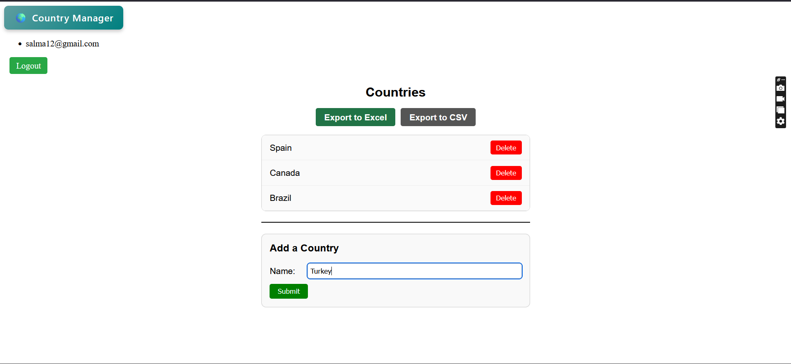

# Country Manager
## 🚀 Introduction

This project is a web application for managing country data, allowing users to view, add, and delete countries, with secure authentication and data export capabilities. It demonstrates a robust implementation of **Clean Architecture** principles within a .NET ecosystem, showcasing modern development practices including MVC, Minimal APIs, Entity Framework Core for data persistence, and comprehensive testing with xUnit.

---

## 🛠️ Technologies Used

A curated selection of modern .NET technologies and best practices:

*   **Core Framework:** ASP.NET Core 10.0
*   **Architecture:** Clean Architecture (Domain, Application, Infrastructure, Presentation layers)
*   **Data Access:** Entity Framework Core 10.0
*   **Database:** SQL Server
*   **Authentication & Authorization:** ASP.NET Core Identity Framework
*   **Testing:** xUnit, TestHost
*   **API Development:** ASP.NET Core Minimal APIs & ASP.NET Core MVC
*   **Excel Generation:** EPPlus, CsvHelper
*   **Dependency Injection:** Built-in ASP.NET Core DI
*   **UI Framework (if applicable):** Razor Pages

---

## 💻 Getting Started

### Prerequisites

*   .NET SDK ([Version, e.g., 10.0.x](https://dotnet.microsoft.com/en-us/download/dotnet/8.0))
*   SQL Server

## Screenshots
# MVC App

# Minimal API
- Get Request

      // Request
      https://localhost:7232/api/minimal/country	
      // Response
      [{"CountryID":"d2485c0c-139c-48ba-9422-3ac1eee6c641","Name":"Brazil"},{"CountryID":"4f4b4608-0478-4c8a-83ce-ed4877e756a1","Name":"Canada"}]

- Add Request

        // Request
        https://localhost:7232/api/minimal/country
        HttpBody:
        {
            "name": "Thiland"
        }
        // Response
        "Add successful"

- Get Request by ID

        // Request
        https://localhost:7232/api/minimal/country/644cd6c4-79c6-44c8-bdf0-d21e780bee40
        // Response
        {
            "countryID": "644cd6c4-79c6-44c8-bdf0-d21e780bee40",
            "name": "Thiland"
        }